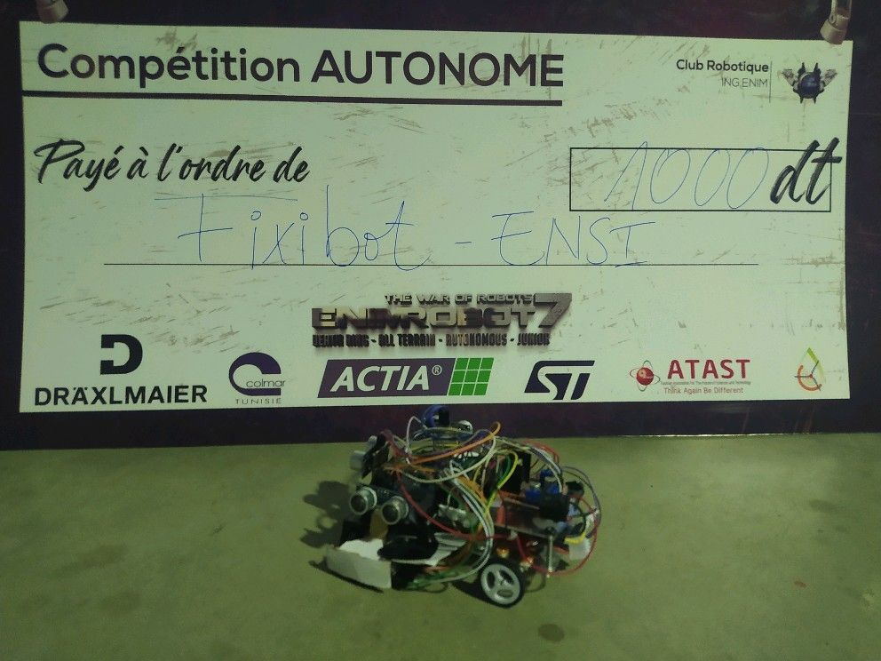

## Description
Fixibot is an award-winning line follower robot designed and built for competitions, showcasing a remarkable fusion of robotics, electronics, and programming expertise. The primary focus of this project was to create an advanced line follower robot capable of navigating challenging courses with exceptional speed and precision.
Employing a sophisticated PID control system, Fixibot achieves outstanding stability and accuracy, enabling it to follow intricate paths flawlessly. The robot's design incorporates cutting-edge sensors and actuators, optimizing its responsiveness and adaptability to various terrains and scenarios.
Through meticulous engineering and optimization, Fixibot showcases the team's ingenuity in creating an intelligent and efficient robot that excels in competition settings. Its remarkable performance has earned numerous accolades and prizes, reinforcing its position as a top contender in line follower competitions.
In this repo i'm sharing with you one of the codes that i've made in a competition.
## Requirements 
Before running this project, make sure you have the following installed:
- Arduino IDE
# Clone the repo 
```
git clone https://github.com/hdfixi/Line-Line-Follower.git
```
# FixiBot 



